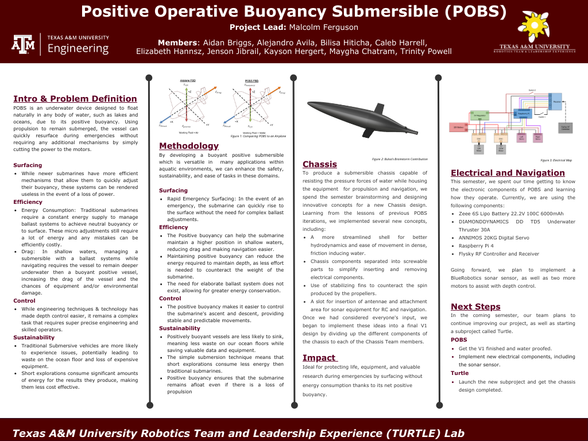

# POBS: Positive Operative Bouyancy Submersable

Description

## Table of Contents

- [Project Overview](#project-overview)
- [Latest Project Showcase Poster](#project-poster)
- [Team Members](#team-members)
- [Getting Started](#getting-started)
- [Contributing](#contributing)
- [License](#license)

<!--- 
- [Key Features](#key-features)
- [Hardware](#hardware)
-->

  
<!--
## Key Features

- **Desired Feature**: Description
- **Desired Feature**: Description
- **Desired Feature**: Description

## Hardware

- **Desired Feature**: Description
- **Desired Feature**: Description
- **Desired Feature**: Description

-->

## Project Overview

Full name and Code; what it is acomplishing and how it is doing so. What we aim for this to prove

primary objectives:
- primary objective #1
- primary objective #2
- primary objective #3


## Project Poster




## Team Members


### Project Leadership
- **[Malcolm Ferguson](https://www.linkedin.com/in/malcolmferg/)**
  - Major: Mechatronics (MXET)
  - Role: Project Lead
  - Year: 2026

- **[Name](https://www.linkedin.com/in/name)**
  - Major: X
  - Role: Chassis Subteam Lead
  - Year: X

- **[Aidan Briggs](https://www.linkedin.com/in/name)**
  - Major: X
  - Role: Electrical and Navigation Subteam Lead
  - Year: X

- **[Name](https://www.linkedin.com/in/name)**
  - Major: X
  - Role: Waterproofing Subteam Lead
  - Year: X

- **[Name](https://www.linkedin.com/in/name)**
  - Major: X
  - Role: Mini Turtle Subteam Lead
  - Year: X


### Chassis Subteam
This team is resposable for designing the different components of the submersable

- **[Maygha Chatram](https://www.linkedin.com/in/name)**
  - Major: X
  - Role: X
  - Year: X

- **[Caleb Harrell](https://www.linkedin.com/in/name)**
  - Major: X
  - Role: X
  - Year: X

- **[Kayson Hergert](https://www.linkedin.com/in/name)**
  - Major: X
  - Role: X
  - Year: X

- **[Bilisa Hiticha](https://www.linkedin.com/in/name)**
  - Major: X
  - Role: X
  - Year: X
    
### Electrical and Navigation Subteam
This team is responsable for the programming and electrical component of the submersable.

- **[Alejandro Avila](https://www.linkedin.com/in/name)**
  - Major: X
  - Role: X
  - Year: X

- **[Aidan Briggs](https://www.linkedin.com/in/name)**
  - Major: X
  - Role: X
  - Year: X

- **[Jenson Jibrail](https://www.linkedin.com/in/name)**
  - Major: X
  - Role: X
  - Year: X

- **[Trinity Powell](https://www.linkedin.com/in/name)**
  - Major: X
  - Role: X
  - Year: X

### Waterproofing Subteam
This team is responsable for water testing the submersable, collecting data, and providing waterproofing recommendations to the Chassis team.

 - **[Elizabeth Hannsz](https://www.linkedin.com/in/name)**
  - Major: X
  - Role: X
  - Year: X

### Mini Turtle Subteam
This team is responsable for our Turtle shaped outreach project.

 - **[Name](https://www.linkedin.com/in/name)**
  - Major: X
  - Role: X
  - Year: X

### Alumni
Former Members of our team!

- **[Calynn Lock](https://www.linkedin.com/in/name)**
  - Major: IDEN
  - Role: Chassis Developer
  - Year: 2022

- **[Andrea Shepperd](https://www.linkedin.com/in/name)**
  - Major: MEEN
  - Role: Chassis Developer
  - Year: 2024

## Getting Started

If you are interested in utilizing our code, the following steps should help you get started:

1. **Clone the Repository**:

    To clone this repository, you may open it through the Github desktop app.

    or 

    For **Windows** or **Mac**:
    1) Copy:

   ```
   https://github.com/turtle-robotics/POBS.git
   ```
    2) In VS Code, open the Command Palette (Ctrl+Shift+P / Command+Shift+P) and type in 

   ```
   Git: Clone
   ```
    3) Paste the URL above into the input box and press enter. VS Code will ask you where you want to save the folder, after that, you will be able to open the Repository.

    For **Linux**:
    1) Copy:

   ```
   git clone https://github.com/[***ReplaceWithYourUsername***]/DRON.git
   ```

2. **Install Dependencies**: Be sure to install the required dependencies and libraries outlined in the project documentation to prevent any issues from arising.

3. **Contribute**: If you have ideas or improvements you would like to contribute, please refer to the [Contributing](#contributing) section below.


## Contributions 

We welcome contributions from the open-source community and anyone interested in enhancing this project. To add your contributions:

1. Fork the POBS repository.

2. Create a new branch for your feature or bug fix:

   ```
   git checkout -b feature/new-feature
   ```

3. Provide your changes and commit them:

   ```
   git commit -m "Add new feature"
   ```

4. Push your changes to your fork:

   ```
   git push origin feature/new-feature
   ```

5. Create a pull request to the `main` branch of this repository.

We appreciate all contributions and input from the community, everything is welcome from code snipbits to documentation and any suggestions.

## License

This project is licensed under the [MIT License](LICENSE). Everyone is free to use, modify, and distribute this code, provided there is appropriate attribution and the original license is included in all distributions. Please review the full license for more details.
